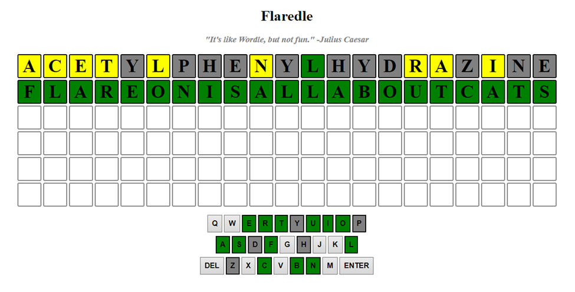

# __Flare-On 9__ 
## _01 - Flaredle_

## Information
**Category** | **Points** | **Writeup Author**
--- | --- | ---
Reverse Engineering | 1 | FazeCT

**Description:** 

Welcome to Flare-On 9!

You probably won't win. Maybe you're like us and spent the year playing Wordle. We made our own version that is too hard to beat without cheating.

Play it live at: http://flare-on.com/flaredle/

7-zip password: flare

## Solution
Đầu tiên, từ source 7z, unzip thu được được 2 file .js và 1 file .css, ta mở lên xem thử thì thấy:
- File word.js chứa kha khá từ, chắc là word cần sử dụng cho challenge này.
- File script.js chứa source của checker.

Đọc qua source script.js ta thấy số lần dự đoán tối đa là 6, nên chắc chắn ko thể brute tất cả trong 1 lần chơi.
Bỏ qua các hàm khởi tạo, ta bước thẳng vào checkGuess()
```
function checkGuess () {
    let row = document.getElementsByClassName("letter-row")[NUMBER_OF_GUESSES - guessesRemaining]
    let guessString = ''
    let rightGuess = Array.from(rightGuessString)

    for (const val of currentGuess) {
        guessString += val
    }

    if (guessString.length != WORD_LENGTH) {
        toastr.error("Not enough letters!")
        return
    }

    if (!WORDS.includes(guessString)) {
        toastr.error("Word not in list!")
        return
    }

    
    for (let i = 0; i < WORD_LENGTH; i++) {
        let letterColor = ''
        let box = row.children[i]
        let letter = currentGuess[i]
        
        let letterPosition = rightGuess.indexOf(currentGuess[i])
        // is letter in the correct guess
        if (letterPosition === -1) {
            letterColor = 'grey'
        } else {
            // now, letter is definitely in word
            // if letter index and right guess index are the same
            // letter is in the right position 
            if (currentGuess[i] === rightGuess[i]) {
                // shade green 
                letterColor = 'green'
            } else {
                // shade box yellow
                letterColor = 'yellow'
            }

            rightGuess[letterPosition] = "#"
        }

        let delay = 250 * i
        setTimeout(()=> {
            //flip box
            animateCSS(box, 'flipInX')
            //shade box
            box.style.backgroundColor = letterColor
            shadeKeyBoard(letter, letterColor)
        }, delay)
    }

    if (guessString === rightGuessString) {
		let flag = rightGuessString + '@flare-on.com';
		toastr.options.timeOut = 0;
		toastr.options.onclick = function() {alert(flag);}
        toastr.success('You guessed right! The flag is ' + flag);

        guessesRemaining = 0
        return
    } else {
        guessesRemaining -= 1;
        currentGuess = [];
        nextLetter = 0;

        if (guessesRemaining === 0) {
            toastr.error("You've run out of guesses! Game over!")
            toastr.info('Try reverse engineering the code to discover the correct "word"!');
        }
    }
}
```
~~Trông có vẻ như không thể reverse được để tìm rightGuessString~~ <sub>(Updated)</sub> , tuy nhiên nhận thấy đây là format giống trò chơi wordle bình thường, nghĩa là sau mỗi lần dự đoán, ký tự tại từng vị trí nếu nằm đúng vị trí so với đáp án thì sẽ hiện màu xanh, còn chỉ nằm trong đáp án mà không đúng chỗ sẽ hiện màu vàng.

**Update: Sau khi pass được challenge này, mình đọc lại thì nhận thấy source code có cho rightGuessString nằm ở index 57 của list, mà đó lại là string nằm ngay trên flareonisallaboutcats (là establishmentarianism). Nên source dưới có thể xem như không cần thiết hoặc cần khi đáp án đúng không được cho sẵn trong source code.**

Dựa vào đó, ta có thể viết source code để giảm số lần phải brute.

```
def process(y, g, idx, wordlist):
    newWORD = []
    for c in wordlist:
        flag = 1
        for d in y:
            if c.find(d) == -1:
                flag = 0
                break
        for i in range(len(idx)):
            if c[idx[i]] != g[i]:
                flag = 0
                break
        if flag: newWORD.append(c)
    wordlist = list(newWORD)
    for c in wordlist:
        print(c)
    return wordlist

wordlist = ['acetylphenylhydrazine',
        'aerobacteriologically',
        'alkylbenzenesulfonate',
        'aminoacetophenetidine',
        'anatomicopathological',
        'anemometrographically',
        'anthropoclimatologist',
        'anthropomorphological',
        'anticonstitutionalism',
        'anticonstitutionalist',
        'antienvironmentalists',
        'antiinstitutionalists',
        'antimaterialistically',
        'antinationalistically',
        'antisupernaturalistic',
        'appendorontgenography',
        'ballistocardiographic',
        'benzalphenylhydrazone',
        'bioelectrogenetically',
        'chemicopharmaceutical',
        'chlamydobacteriaceous',
        'cholecystogastrostomy',
        'cholecystojejunostomy',
        'cholecystolithotripsy',
        'cholecystonephrostomy',
        'choledochoenterostomy',
        'choledocholithotripsy',
        'chromophotolithograph',
        'cineangiocardiography',
        'cytospectrophotometry',
        'clinicopathologically',
        'constitutionalization',
        'counterclassification',
        'counterdemonstrations',
        'counterindoctrination',
        'counterinterpretation',
        'counterproductiveness',
        'counterpronunciamento',
        'counterreconnaissance',
        'cryptocrystallization',
        'crystalloluminescence',
        'dacryocystorhinostomy',
        'dehydrocorticosterone',
        'deintellectualization',
        'demarcatordemarcators',
        'dendrochronologically',
        'disestablishmentarian',
        'disproportionableness',
        'duodenocholedochotomy',
        'duodenopancreatectomy',
        'electrodiagnostically',
        'electroencephalograms',
        'electroencephalograph',
        'electromyographically',
        'electrotheraputically',
        'enterocholecystostomy',
        'establishmentarianism',
        'flareonisallaboutcats',
        'gastroenterocolostomy',
        'gastroenterologically',
        'glossolabiopharyngeal',
        'hepaticoenterostomies',
        'heterotransplantation',
        'hexachlorocyclohexane',
        'hydrodesulphurization',
        'hydroxycorticosterone',
        'hyperaggressivenesses',
        'hyperconservativeness',
        'hyperconstitutionally',
        'hyperenthusiastically',
        'hyperintellectualness',
        'hyperpolysyllabically',
        'hypsidolichocephalism',
        'historicogeographical',
        'historicophilosophica',
        'humuhumunukunukuapuaa',
        'immunoelectrophoresis',
        'immunoelectrophoretic',
        'indistinguishableness',
        'intellectualistically',
        'internationalizations',
        'intertransformability',
        'isopropylideneacetone',
        'labioglossopharyngeal',
        'magnetofluidmechanics',
        'magnetoplasmadynamics',
        'mandibulosuspensorial',
        'mechanicointellectual',
        'mechanotheraputically',
        'membranocartilaginous',
        'methyltrinitrobenzene',
        'microcolorimetrically',
        'microminiaturizations',
        'microradiographically',
        'microseismometrograph',
        'nitrotrichloromethane',
        'nonautobiographically',
        'noncharacteristically',
        'nonimpressionableness',
        'noninterchangeability',
        'nonpsychoanalytically',
        'nonrepresentativeness',
        'otorhinolaryngologist',
        'overargumentativeness',
        'overcommercialization',
        'overconscientiousness',
        'overgesticulativeness',
        'overimpressionability',
        'overindividualization',
        'overindustrialization',
        'overintellectualizing',
        'oversuperstitiousness',
        'palaeodendrologically',
        'pancreatoduodenectomy',
        'parathyroidectomizing',
        'pathologicoanatomical',
        'pentamethylenediamine',
        'pharyngoepiglottidean',
        'pharmacoendocrinology',
        'phenylethylmalonylure',
        'philosophicoreligious',
        'phoneticohieroglyphic',
        'phosphoglyceraldehyde',
        'photochromolithograph',
        'photolithographically',
        'photomicrographically',
        'phthalylsulfathiazole',
        'platydolichocephalous',
        'poliencephalomyelitis',
        'poluphloisboiotatotic',
        'prostatovesiculectomy',
        'protransubstantiation',
        'pseudoanachronistical',
        'pseudoanthropological',
        'pseudohermaphroditism',
        'pseudolamellibranchia',
        'pseudoparthenogenesis',
        'pseudophilanthropical',
        'psychopharmacological',
        'psychophysiologically',
        'psychotherapeutically',
        'representationalistic',
        'scientificohistorical',
        'scleroticochoroiditis',
        'selectivitysenescence',
        'semianthropologically',
        'sphygmomanometrically',
        'stereomicroscopically',
        'stereophotomicrograph',
        'stereoroentgenography',
        'succinylsulfathiazole',
        'superconservativeness',
        'superconstitutionally',
        'superincomprehensible',
        'superincomprehensibly',
        'supertranscendentness',
        'tessarescaedecahedron',
        'tetrabromofluorescein',
        'thermophosphorescence',
        'transcendentalisation',
        'transcendentalization',
        'transubstantiationite',
        'triacetyloleandomycin',
        'trichloroacetaldehyde',
        'trichloronitromethane',
        'uncontemporaneousness',
        'undistinguishableness',
        'unstraightforwardness',
        'ureteropyelonephritis',
        'zygomaticoauricularis',
        ]

for i in range(6):

    y = list(input())
    g = list(input())
    idx = list(map(int, input().split()))
    wordlist = process(y, g, idx, wordlist)
```
Viết xong chạy thử 1 lần sau khi nhập string acetylphenylhydrazine thì thấy trả ra list gồm 5 string khác, trong đó có 1 string khá sus là flareonisallaboutcats, submit thử thì đúng luôn :))




> Flag is: flareonisallaboutcats@flare-on.com
