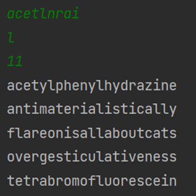

# __Flare-On 9__ 
## _02 - Pixel Poker_

## Information
**Category** | **Points** | **Writeup Author**
--- | --- | ---
Reverse Engineering | 1 | FazeCT

**Description:** 

I said you wouldn't win that last one. I lied. The last challenge was basically a captcha. Now the real work begins. Shall we play another game?

## Solution
Đầu tiên, từ source 7z, unzip thu được được 1 file .exe và 1 file .txt.

Sử dụng cả dnSpy và dotPeek đều không trả ra gì có ích cả, tuy nhiên sử dụng IDA thì khác.
Khi decompile bằng IDA, ta thấy hàm **wWinMain()** được gọi.



Tiếp tục thấy trong hàm **wWinMain()**, trước khi result được tính từ hàm **sub_401040()**, hàm **sub_401120()** được gọi.


Ta kiểm tra hàm **sub_401120()**, nhận thấy chương trình đang khởi tạo một class, trong đó đáng chú ý là attribute lpfnWndProc tiếp tục là giá trị được trả về từ hàm **sub_4012C0**.


Trong hàm **sub_4012C0**, các thuộc tính của chương trình được thể hiện khá rõ như khi nào thì chương trình exit,... Tuy nhiên cái quan trọng cần chú ý là dòng sau:

> _snprintf(String, 0x104u, "PixelPoker (%d,%d) - #%d/%d",(__int16)lParam, SHIWORD(lParam), dword_413298, 10);

**lParam** và **SHIWORD(lParam)** chính là 2 giá trị ~~có lẽ~~ chúng ta cần tìm để giải được Challenge này.
Tiếp tục kiểm tra xuống dưới ta thấy có 2 điều kiện được kiểm tra:
```
(__int16)lParam == dword_412004 % (unsigned int)cxval 
SHIWORD(lParam) == dword_412008 % (unsigned int)cyval
```
Trong đó dword_412004 có giá trị bằng 0x52414C46 và dword_412008 có giá trị bằng 0x6E4F2D45.
Vậy, việc còn lại chỉ là tìm kiếm **cxval** và **cyval**.

Quay trở lại với hàm **sub_401040()** - nơi result được trả về, ta có thể thực hiện kỹ thuật debugging để có được giá trị của **cxval** và **cyval** lần lượt là **741** và **641**.


Từ đó ta có được tọa độ của vị trí cần click trong .exe để pass Challenge này.

> Flag is: w1nN3r_W<span>!NneR_cHick3n_d1nNer@fla</span>re-on.com

