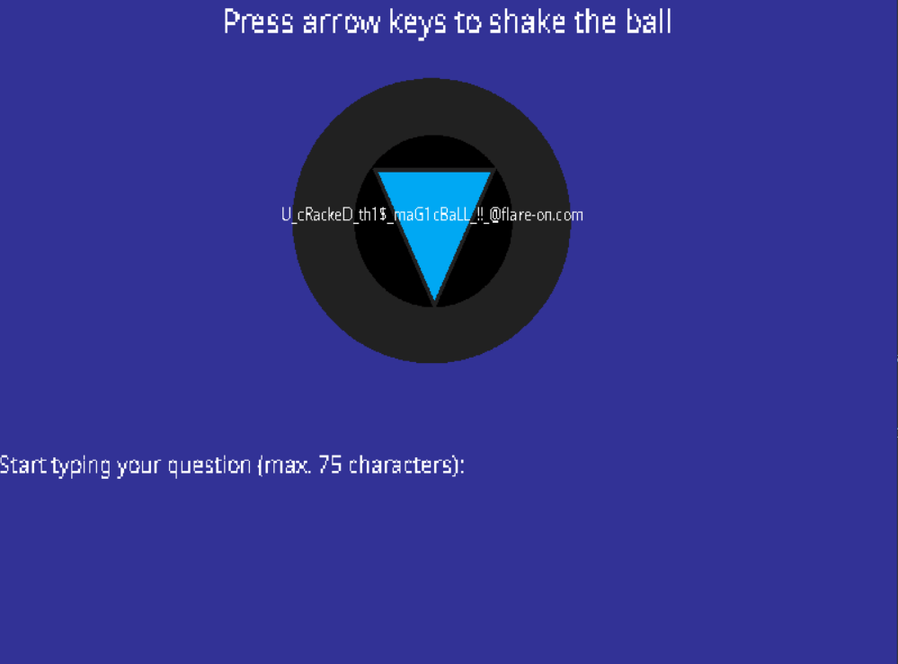

# __Flare-On 9__ 
## _03 - Magic 8 Ball_

## Information
**Category** | **Points** | **Writeup Author**
--- | --- | ---
Reverse Engineering | 1 | FazeCT

**Description:** 

You got a question? Ask the 8 ball!

## Solution
Đầu tiên, mở thử .exe lên thì thấy giao diện cho phép nhập vào một chuỗi, đồng thời có thể bấm các nút mũi tên để lắc quả bóng. Sau khi nhập chuỗi và bấm Enter, sẽ trả ra "lời nói" từ quả bóng.


Decompile bằng IDA ra thử, đọc sơ qua các hàm thì thấy có hàm **WinMain()**, bấm vào thì thấy nó return **sub_403690()**.
Trong hàm **sub_403690()**, hàm **sub_4027A0()** được gọi, đây chính là main của .exe.
```
int __stdcall WinMain(HINSTANCE hInstance, HINSTANCE hPrevInstance, LPSTR lpCmdLine, int nShowCmd)
{
  return sub_403690();
}
```
```
for ( i = sub_4027A0(pNumArgs, v4); v11 < pNumArgs; ++v11 )
```
Lần lượt kiểm tra các lời gọi hàm khác từ hàm này, ta thấy có một số hàm như **sub_4012B0()** (là hàm chứa các "lời nói" của quả bóng), **sub_402090()** (hàm này khá sus vì có chứa chuỗi liên quan đến flag, đó là **"gimme flag pls?"** ở **this + 92**, và input từ user được lưu vào **this + 248**.
```
strcpy(this + 92, "gimme flag pls?");
...
sub_4018F0(this + 224, "Start typing your question (max. 75 characters): ", 0x31u);
sub_4018F0(this + 248, &unk_40426C, 0);
```
Tiếp tục, ta thấy có 3 hàm được gọi tiếp đó là **sub_401E50()**, **sub_4024E0()** và **sub_4022A0()**. Trong đó, mình nhận thấy hàm **sub_4024E0()** có tiềm năng giúp pass challenge này nhất, vì trong đó lồng khá nhiều điều kiện if kiểm tra.
```
if ( v3 && *(_BYTE *)dword_406090 )
  {
    do
    {
      Ticks = SDL_GetTicks(v5);
      sub_401E50((char *)dword_406090);
      sub_4024E0(dword_406090);
      sub_4022A0(dword_406090);
      v8 = SDL_GetTicks(v7) - Ticks;
      if ( v8 < 16 )
        SDL_Delay(16 - v8);
      v5 = (_DWORD *)dword_406090;
    }
    while ( *(_BYTE *)dword_406090 );
  }
```
Đi vào hàm **sub_4024E0()**, ở đoạn có nhiều điều kiện được lồng vào như đã nói trên, ta nhận thấy các char được so sánh chỉ bao gồm 'L', 'R', 'U', 'D', vừa hay đây cũng là 4 hướng mũi tên Left, Right, Up, Down. Nếu điều kiện thỏa, chương trình sẽ thực hiện so sánh **v22 (= this + 248)** và **this + 92**.
```
if ( *(_BYTE *)(this + 345) )
  {
    v12 = v4[5];
    v13 = v4;
    if ( v12 >= 0x10 )
      v13 = (_BYTE *)*v4;
    if ( *v13 == 'L' )
    {
      v14 = v4;
      if ( v12 >= 0x10 )
        v14 = (_BYTE *)*v4;
      if ( v14[1] == 'L' )
      {
        v15 = v4;
        if ( v12 >= 0x10 )
          v15 = (_BYTE *)*v4;
        if ( v15[2] == 'U' )
        {
          v16 = v4;
          if ( v12 >= 0x10 )
            v16 = (_BYTE *)*v4;
          if ( v16[3] == 'R' )
          {
            v17 = v4;
            if ( v12 >= 0x10 )
              v17 = (_BYTE *)*v4;
            if ( v17[4] == 'U' )
            {
              v18 = v4;
              if ( v12 >= 0x10 )
                v18 = (_BYTE *)*v4;
              if ( v18[5] == 'L' )
              {
                v19 = v4;
                if ( v12 >= 0x10 )
                  v19 = (_BYTE *)*v4;
                if ( v19[6] == 'D' )
                {
                  v20 = v4;
                  if ( v12 >= 0x10 )
                    v20 = (_BYTE *)*v4;
                  if ( v20[7] == 'U' )
                  {
                    v21 = v4;
                    if ( v12 >= 0x10 )
                      v21 = (_BYTE *)*v4;
                    if ( v21[8] == 'L' )
                    {
                      v22 = (const char *)(this + 248);
                      if ( *(_DWORD *)(this + 268) >= 0x10u )
                        v22 = *(const char **)v22;
                      if ( !strncmp(v22, (const char *)(this + 92), 15u) )
                      {
                        sub_401220(v4);
                        sub_401A10((_BYTE *)this, v23, v24, v25, v26, v27, v28);
                      }
                    }
                  }
                }
              }
            }
          }
        }
      }
    }
  }
```
Tại điểm này, cùng với việc đã có được **this + 92** từ trước **("gimme flag pls?")** và biết được **this + 248** là input từ user, mình cũng phần nào đoán được cách crack được .exe này, đó là nhập vào chuỗi **"gimme flag pls?"**, đồng thời bấm các nút mũi tên đúng theo thứ tự điều kiện if **("LLURULDUL")**.



> Flag is: U\_cR<span>ackeD\_th1$\_maG1cBaLL\_!!\_@flar</span>e-on.com
