## Introduction

Lời đầu tiên, mình (FazeCT) - một thành viên của team RE trong câu lạc bộ An toàn thông tin HCMUT (BKISC) xin gửi lời chào đến các bạn!

Trong bài viết này, mình sẽ giúp các bạn hiểu được basics của mảng Reverse Engineering - RE, một trong 4 mảng chính của CTF.

Trước khi vào Write-Up, mình muốn các bạn thử đọc qua slide sau đây để nắm rõ thuật ngữ cơ bản trong RE, cũng như hiểu được một trong những dạng bài của RE, đó là Unity RE: [go to slide](https://docs.google.com/presentation/d/10Z2u5gLyN5w5rhyMwWNFmZaDFL8Nbbjfsqf0z8HDsUc/edit?usp=sharing)

Sau đây sẽ là Write-Up của một bài Unity RE đến từ **SEKAI CTF 2022**.

## Information
**Category** | **Writeup Author**
--- | ---
Reverse Engineering | FazeCT

**Description:** 

(Challenge từ SEKAI CTF 2022)

[...] Giành chiến thắng trong trò chơi mô phỏng lại dựa trên tựa game [Fall Guy](https://vi.wikipedia.org/wiki/Fall_Guys).

(chỗ này quăng cái link zip, pass: bkisc)

## First Observation

Để thuận tiện cho các bạn mới tìm hiểu về mảng RE, mình sẽ mở đầu bằng cách phân tích về những file trong zip.

Như đã đề cập đến trong slide phía trên, 2 folder sẽ chứa tài nguyên của game và file thực thi .exe sẽ là game chúng ta cần crack.

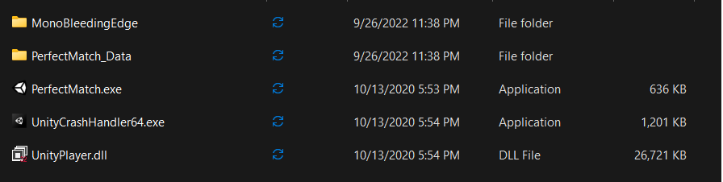

Mình tiến hành mở .exe lên chơi thử, cách vận hành của game này được lấy ý tưởng từ màn chơi [Perfect Match](https://fallguysultimateknockout.fandom.com/wiki/Perfect_Match) của tựa game Fall Guy.

(chỗ này quăng cái clip pmxt.mp4 trong /PMXTResources)

Để có được flag, ta cần vượt qua màn chơi này mà không bị rơi xuống phía dưới.

## Solution

Sử dụng các tool (dnSpy, dotPeek hay IDA) như trong slide có đề cập đến để decompile file **Assembly-CSharp.dll** chứa trong đường dẫn **.../Perfect_Match_X-treme/Build/PerfectMatch_Data/Managed/Assembly-CSharp.dll**

Sau khi decompile, ban đầu ta sẽ thấy cửa sổ như sau trong dnSpy:

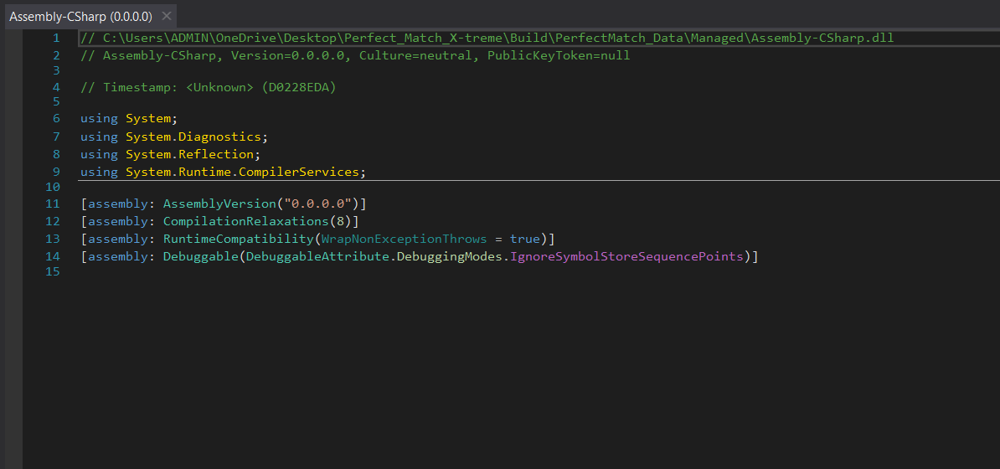

Ở phía bên trái, ta có một cửa sổ hiển thị danh sách các thành phần của file **Assembly-CSharp.dll**.

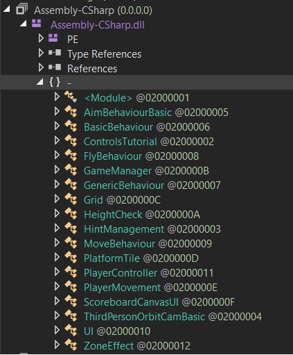

Toàn bộ phần màu xanh chính là các **GameObject** mà mình đã đề cập đến trong slide ở phía trên, trong đó có **GameManager** mà ta có thể nói rằng nó là main để vận hành trò chơi.

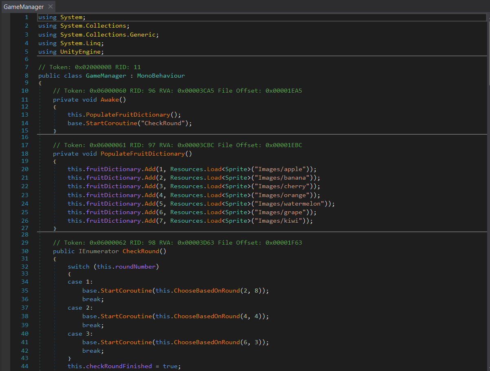

Trên đây là cấu trúc của **GameManager** được decompile thành pseudocode của ngôn ngữ **C#**. Mỗi hàm của **GameManager** đều có một chức năng riêng, như 
**ChooseBasedOnRound()** là hàm để setup mỗi round, hay **ChooseFruit()** cũng là một hàm để setup platform của màn chơi. Tuy nhiên, ta nhận thấy có một hàm tên là **IncreaseRound()** dùng để kiểm tra tiến độ game mà trong đó ta thấy dòng lệnh **isGameOver = true;**, đây có thể hiểu là câu lệnh dùng để kết thúc game.

```
public void IncreaseRound()
{
	if (this.roundNumber + 1 <= 3)
	{
		this.roundNumber++;
		base.StartCoroutine("CheckRound");
		return;
	} //sau khi vượt qua 3 round đấu, game sẽ kết thúc.
	this.isGameOver = true;
}
```
Thử edit module để bỏ dòng lệnh **this.isGameOver = true;** lên trên đầu class, tức ngay trong **void Awake()**. Cách thức **edit class/module** đã được mình hướng dẫn trong slide phía trên.

**Lưu ý:** Không nên dùng **edit class** để edit, mà dùng **edit module**. Nếu dùng edit class sẽ xảy ra lỗi compile ở các module khác (vì pseudocode được decompile lại thường không đúng hoàn toàn 100% như bản gốc nên sẽ xảy ra thiếu hụt dữ liệu dẫn đến lỗi.

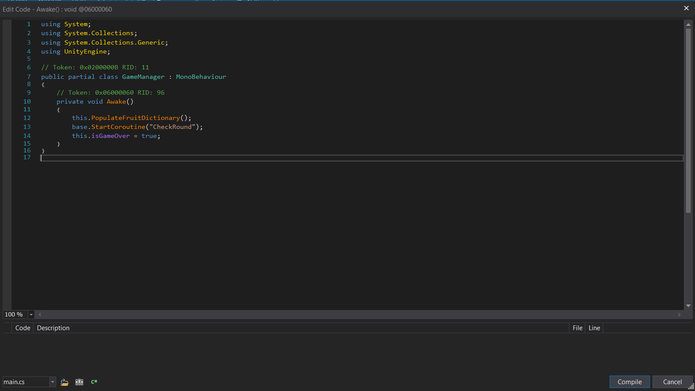

Sau khi compile xong, ta tiến hành save module, lưu đè lên file **.dll** gốc (nên backup file **.dll** gốc).

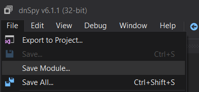

Tiếp tục bật game lên chơi thử thôi...

(chỗ này quăng cái clip pmxt2.mp4 trong /PMXTResources)

Tới đây, công đoạn crack cũng gần như xong rồi, chỉ còn tìm cách đọc flag. Ở đây theo mình thì có 2 lựa chọn, một là tìm cách xóa object để đọc flag, hai (cách này hơi unintended) là chỉnh tốc độ và bước nhảy của nhân vật để đọc flag từ các góc khác nhau. Mình đã phá cách và chọn hướng thứ 2.

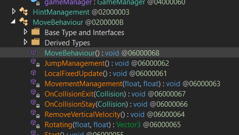

Trong số các **GameObject**, ta có **MoveBehaviour**, trong đó có hàm **MoveBehaviour()** chứa các thông tin của nhân vật. Mình đã chỉnh một số thông số như hình dưới đây:

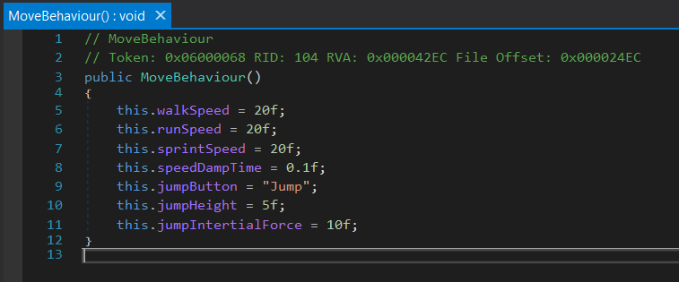

Save module, vào game, canh thời gian nhảy xuống để vừa kịp nhìn flag từ dưới lên mà không bị eliminated do vượt quá độ sâu thấp nhất cho phép.

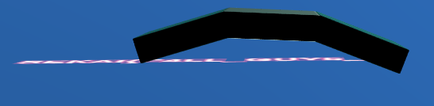
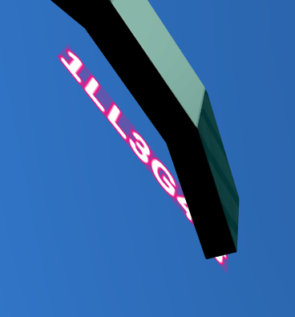
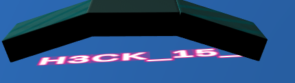

> Flag: SEKAI{F4LL_GUY5_H3CK_15_1LL3G4L}

## Conclusion

Trên đây là Write-Up về một bài Unity RE khá thú vị, kiểu challenge như này thường ít thấy (từ lúc mình chơi trong BKISC tới giờ thì số lần gặp chắc đếm trên đầu ngón tay) nhưng mỗi lần gặp một bài Unity đều làm cho mình cảm thấy thán phục về sự đầu tư của các organizers cho các challenge RE.

Cuối cùng, mình hy vọng qua bài viết trên đây của mình thì hy vọng các bạn (đặc biệt là các bạn sắp tới có dự định theo mảng RE) có một góc nhìn tổng quan về cách thức giải quyết một vấn đề trong mảng Reverse Engineering.

# **YOUR SECURITY, OUR PASSION - BKISC**
